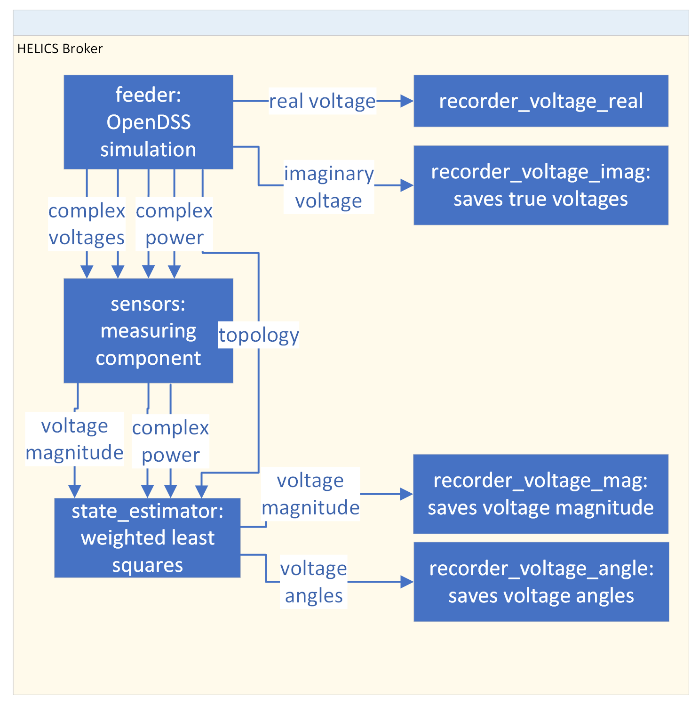
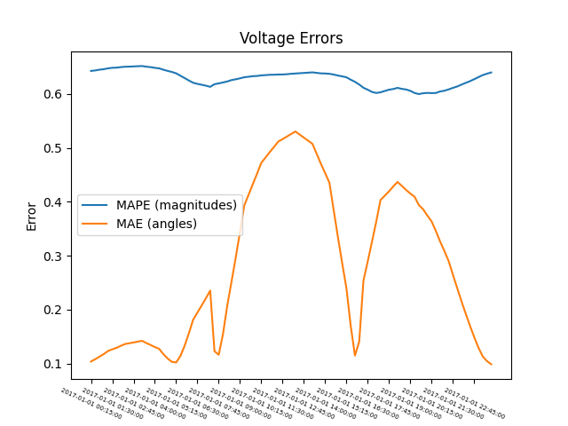
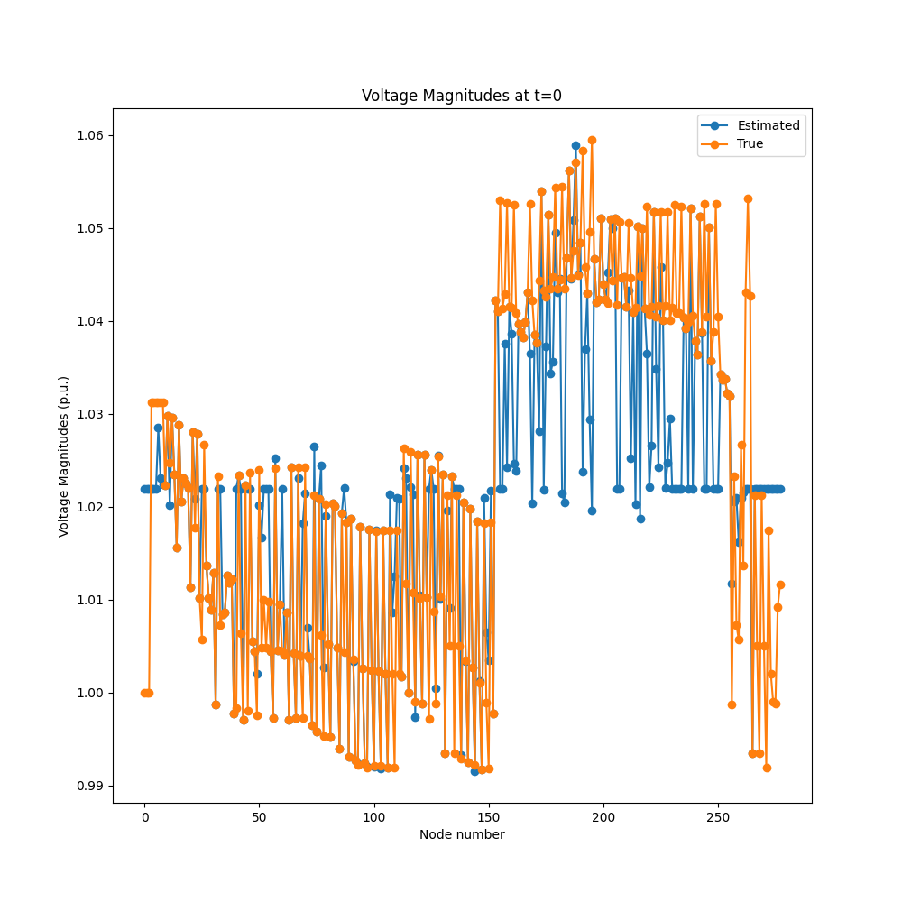
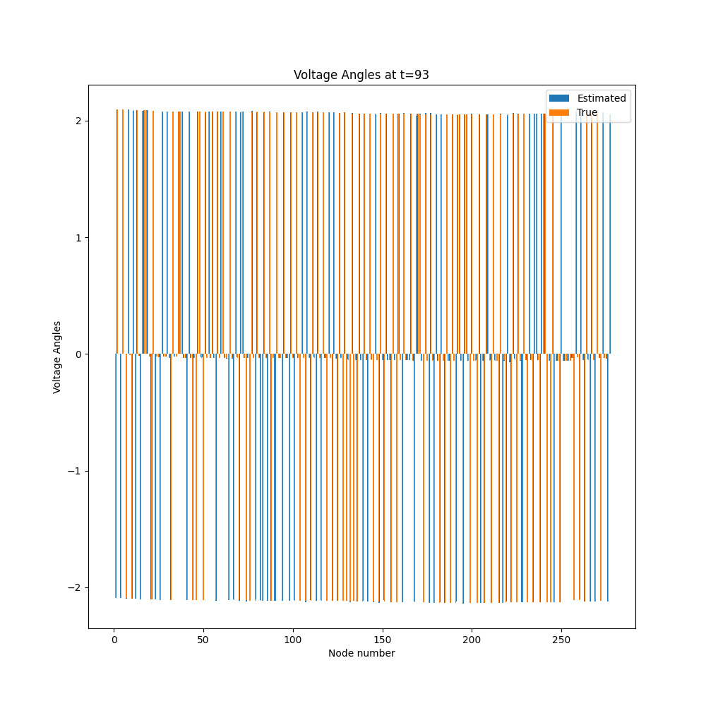
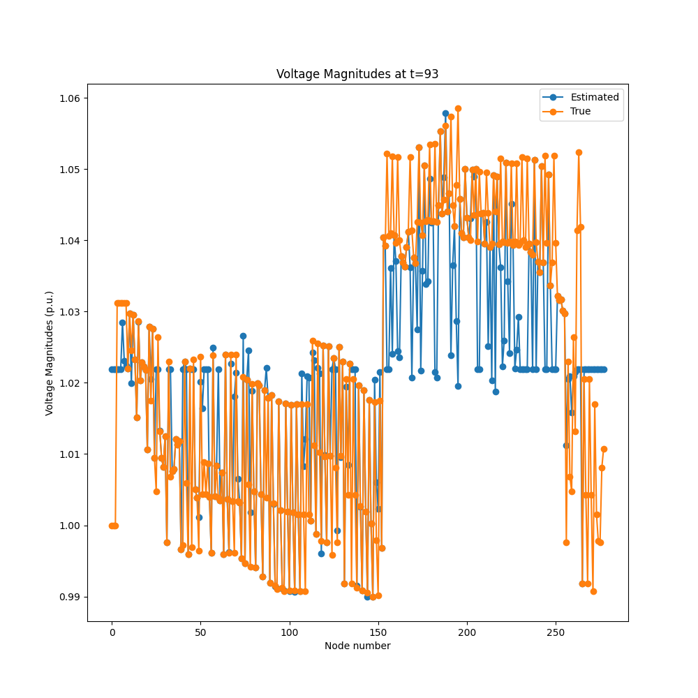

# oedisi-example

[](https://github.com/openEDI/oedisi-example/actions/workflows/test-api.yml)
[](https://github.com/openEDI/oedisi-example/actions/workflows/docker-test.yml)
[](https://github.com/openEDI/oedisi-example/actions/workflows/unit-test-federates.yml)
[](https://github.com/openEDI/oedisi-example/actions/workflows/verify-dockerfiles.yml)

This example shows how to use the GADAL api to manage simulations. We also
use it as a testing ground for the testing the combination of feeders,
state estimation, and distributed OPF.

## Component Status

| Component | Tests | Verify |
|-----------|-------|--------|
| **Broker** | [](https://github.com/openEDI/oedisi-example/actions/workflows/test-broker.yml) | [](https://github.com/openEDI/oedisi-example/actions/workflows/verify-components.yml) |
| **LinDistFlow** | [](https://github.com/openEDI/oedisi-example/actions/workflows/test-lindistflow.yml) | [](https://github.com/openEDI/oedisi-example/actions/workflows/verify-components.yml) |
| **LocalFeeder** | [](https://github.com/openEDI/oedisi-example/actions/workflows/test-localfeeder.yml) | [](https://github.com/openEDI/oedisi-example/actions/workflows/verify-components.yml) |
| **Measuring** | [](https://github.com/openEDI/oedisi-example/actions/workflows/test-measuring.yml) | [](https://github.com/openEDI/oedisi-example/actions/workflows/verify-components.yml) |
| **Recorder** | [](https://github.com/openEDI/oedisi-example/actions/workflows/test-recorder.yml) | [](https://github.com/openEDI/oedisi-example/actions/workflows/verify-components.yml) |
| **WLS** | [](https://github.com/openEDI/oedisi-example/actions/workflows/test-wls.yml) | [](https://github.com/openEDI/oedisi-example/actions/workflows/verify-components.yml) |

## Monorepo Structure

This repository is organized as a Python monorepo containing 6 independent but related components for power system co-simulation. See the **Component Status** table above for test and Docker build status for each component.

**Components:**
- **[broker](Components/broker/README.md)** - Central orchestration service for HELICS federates
- **[lindistflow_federate](Components/lindistflow_federate/README.md)** - Optimal power flow using linear distflow
- **[localfeeder](Components/LocalFeeder/README.md)** - OpenDSS-based distribution feeder simulator  
- **[measuring_federate](Components/measuring_federate/README.md)** - Sensor simulation with noise injection
- **[recorder](Components/recorder/README.md)** - Data recording for co-simulation outputs
- **[wls_federate](Components/wls_federate/README.md)** - Weighted least squares state estimation

**Each component includes:**
- ✅ `pyproject.toml` for modern Python packaging (PEP 621)
- ✅ Comprehensive test suite with pytest
- ✅ Individual README documentation
- ✅ Standardized code quality tools (mypy, pytest, black, isort)
- ✅ Dockerfile for containerization
- ✅ GitHub Actions workflow for automated testing

### Continuous Integration

Each component has its own GitHub Actions workflow that:
- Runs tests on Python 3.10 and 3.11
- Performs type checking with mypy
- Generates code coverage reports
- Triggers on changes to component code

Additionally:
- **Dockerfile Verification**: Ensures all components have valid Dockerfiles
- **Integration Tests**: End-to-end system testing
- **Docker Build Tests**: Validates container builds

### Quick Start - Development Installation

Install all components in editable mode from the repository root:

```bash
# Install all components for development
pip install -e Components/broker -e Components/lindistflow_federate -e Components/LocalFeeder \
            -e Components/measuring_federate -e Components/recorder -e Components/wls_federate

# Or install with dev dependencies
pip install -e "Components/broker[dev]" -e "Components/lindistflow_federate[dev]" \
            -e "Components/LocalFeeder[dev]" -e "Components/measuring_federate[dev]" \
            -e "Components/recorder[dev]" -e "Components/wls_federate[dev]"
```

### Running Tests

Run all tests from the repository root:
```bash
pytest Components/
```

Run tests for a specific component:
```bash
pytest Components/broker/tests/
pytest Components/wls_federate/tests/
```

Run with coverage:
```bash
pytest --cov=Components --cov-report=html Components/
```

### Code Quality

The repository uses standardized code quality tools configured in [pyproject.toml](pyproject.toml):

```bash
# Format code
black Components/
isort Components/

# Type checking
mypy Components/

# Linting
flake8 Components/

# Check docstrings
pydocstyle Components/
```

Install pre-commit hooks:
```bash
pre-commit install
```

# Install and Running Locally

## Installation

1. Install component dependencies. You can either:

   **Option A: Install from monorepo** (recommended for development)
   ```bash
   pip install -e Components/broker -e Components/lindistflow_federate -e Components/LocalFeeder \
               -e Components/measuring_federate -e Components/recorder -e Components/wls_federate
   ```

   **Option B: Install from requirements.txt** (legacy method)
   ```bash
   pip install -r requirements.txt
   ```

2. Install development tools (optional):
   ```bash
   pip install pytest mypy black isort flake8 pydocstyle pre-commit
   ```

## Running Simulations

1. Build the simulation system:
```bash
oedisi build --system scenarios/docker_system.json
```

This initializes the system defined in `scenarios/test_system.json` in a `build` directory.

You can specify your own directory with `--build-dir` and your own system json
with `--system`.

2. Run `oedisi run`

3. Analyze the results using `python post_analysis.py`

This computes some percentage relative errors in magnitude (MAPE) and angle (MAE),
as well as plots in `errors.png`, `voltage_magnitudes_0.png`, `voltage_angles_0.png`, etc.

If you put your outputs in a separate directory, you can run `python post_analysis.py [output_directory]`.

## Troubleshooting

If the simulation fails, you may **need** to kill the `helics_broker` manually before you can start a new simulation.

When debugging, you should check the `.log` files for errors. Error code `-9` usually occurs
when it is killed by the broker as opposed to failing directly.

You can use the `oedisi` CLI tools to help debug specific components or timing.

- `oedisi run-with-pause`
- `oedisi debug-component --foreground feeder`

# Components

All the required components are defined in folders within this repo. Each component
pulls types from `oedisi.types.data_types`.



## Component Overview

Each component is a standalone Python package with its own documentation. Click the component name for detailed information:

### **[Broker](Components/broker/README.md)**
Central orchestration service for HELICS federates. Provides REST API endpoints for federate coordination and HELICS broker management.

### **[LinDistFlow Federate](Components/lindistflow_federate/README.md)**  
Optimal power flow using linear distflow formulation. Implements convex optimization (cvxpy) for three-phase distribution system control.

### **[LocalFeeder](Components/LocalFeeder/README.md)** (AWSFeeder)
OpenDSS-based distribution feeder simulator. Loads SMART-DS feeders and outputs:
- Topology: Y-matrix, slack bus, initial phases
- Powers and voltages for all nodes
- Real-time power flow simulation

### **[Measuring Federate](Components/measuring_federate/README.md)**
Sensor simulation with noise injection. Takes MeasurementArray inputs and outputs subsets at specified nodes with:
- Additive Gaussian noise
- Multiplicative (percentage) noise
- Configurable per-sensor parameters

This federate is instantiated as multiple sensors for each type of measurement.

### **[WLS Federate](Components/wls_federate/README.md)**
Weighted Least Squares state estimation. Reads topology from the feeder simulation and measurements from the measuring federates, then outputs estimated voltages and power with angles.

### **[Recorder](Components/recorder/README.md)**
Data recording federate. Connects to HELICS subscriptions and saves data to:
- `.feather` files (PyArrow columnar format - efficient)
- `.csv` files (human-readable format)

This component is instantiated multiple times in the simulation for every subscription of interest.
This is similar to the HELICS observer functionality, but with more specific data types.

## Component Package Structure

Each component follows a standardized src-layout structure:
```
Components/{component}/
├── src/
│   └── {package_name}/
│       ├── __init__.py          # Package initialization with version
│       ├── server.py            # FastAPI REST server with main() entry point
│       └── {main_module}.py     # Core federate implementation
├── tests/                       # Test suite (outside src for isolation)
│   ├── __init__.py
│   └── test_*.py
├── pyproject.toml               # Modern Python packaging (PEP 621)
├── requirements.txt             # Legacy dependency specification  
├── README.md                    # Comprehensive component documentation
├── pytest.ini                   # Test configuration
├── mypy.ini                     # Type checking configuration
├── .gitignore                   # Python gitignore patterns
├── Dockerfile                   # Container image definition
└── component_definition.json    # OEDISI component spec (inputs/outputs)
```

**Benefits of src-layout:**
- Clear separation between source code and tests
- Prevents accidental imports from development directory
- Ensures tests run against installed package
- Standard practice for modern Python packages

## Component Definitions

Components use `component_definition.json` files in each directory to define their dynamic inputs and outputs. This allows the OEDISI framework to:
- Configure connections between federates
- Validate wiring diagrams
- Generate appropriate subscriptions/publications
- Build simulation systems declaratively

# How was the example constructed?

For each component, you need a `component_description.json` with
information about the inputs and outputs of each component.
We created component python scripts that matched these component
descriptions and followed the GADAL API for configuration.

In order to use the data types from other federates, the `oedisi.types`
module is critical. If additional data is needed, then we recommend
subclassing the pydantic models and adding the data in the required federates
as needed. This ensures that others should still be able to parse your types if
necessary. Using compatible types is usually the most difficult part of integrating
into a system.

A basic system description with the `test_system.json` is also
needed for the simulation.

In `test_full_systems.py`, we load in the various `components_description`s and
the wiring diagram `test_system.json`. The system is initialized and then the
`test_system_runner.json` is saved. During this process, directories are created
for each component with the right configuration.

# Results









# Docker Container

```bash
docker build -t oedisi-example:0.0.0 .
```

To get a docker volume pointed at the right place locally, we have to run more commands
```bash
mkdir outputs_build
docker volume create --name oedisi_output --opt type=none --opt device=$(PWD)/outputs_build --opt o=bind
```

If `pwd` is unavailable on your system, then you must specify the exact path. On windows, this will end up
being `/c/Users/.../outputs_builds/`. You must use forward slashes.

Then we can run the docker image:
```bash
docker run --rm --mount source=oedisi_output,target=/simulation/outputs oedisi-example:0.0.0
```

You can omit the docker volume parts as well as `--mount` if you do not care about the exact outputs.

## Docker Containers on M1 or M2

Since HELICS does not have linux ARM builds, you have to run with

```bash
export DOCKER_DEFAULT_PLATFORM=linux/amd64
```
